# Procesverslag
Markdown is een simpele manier om HTML te schrijven.  
Markdown cheat cheet: [Hulp bij het schrijven van Markdown](https://github.com/adam-p/markdown-here/wiki/Markdown-Cheatsheet).

Nb. De standaardstructuur en de spartaanse opmaak van de README.md zijn helemaal prima. Het gaat om de inhoud van je procesverslag. Besteedt de tijd voor pracht en praal aan je website.

Nb. Door *open* toe te voegen aan een *details* element kun je deze standaard open zetten. Fijn om dat steeds voor de relevante stuk(ken) te doen.

## Jij

uitwerken voor kick-off werkgroep

### Auteur:
Yara Prins

#### Je startniveau:
Rood ( / Zwart, als ik weer even bezig ben)

#### Je focus:
Mijn focus ligt meer op responsive, maar ik wil eigenlijk voor beide gaan.
 

## Je website

uitwerken voor kick-off werkgroep

### Je opdracht:
https://www.dndbeyond.com/

#### Screenshot(s) van de eerste pagina (small screen): 
Homepagina van DndBeyond

  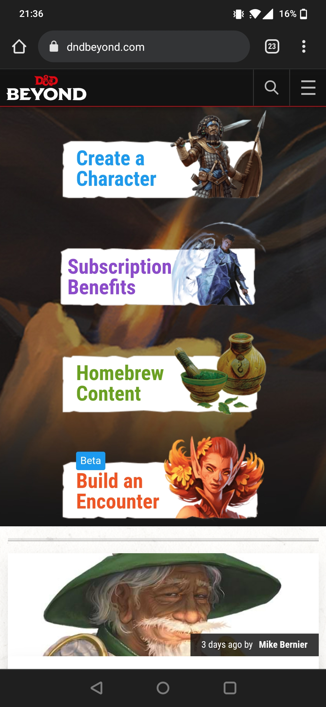

#### Screenshot(s) van de tweede pagina (small screen):
Hoofdpagina Eigen Karakter 

  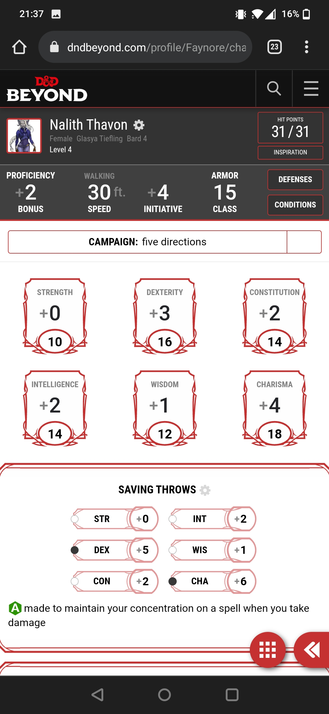

 

## Breakdownschets (week 1)

uitwerken na afloop 2e werkgroep

### de hele pagina: 
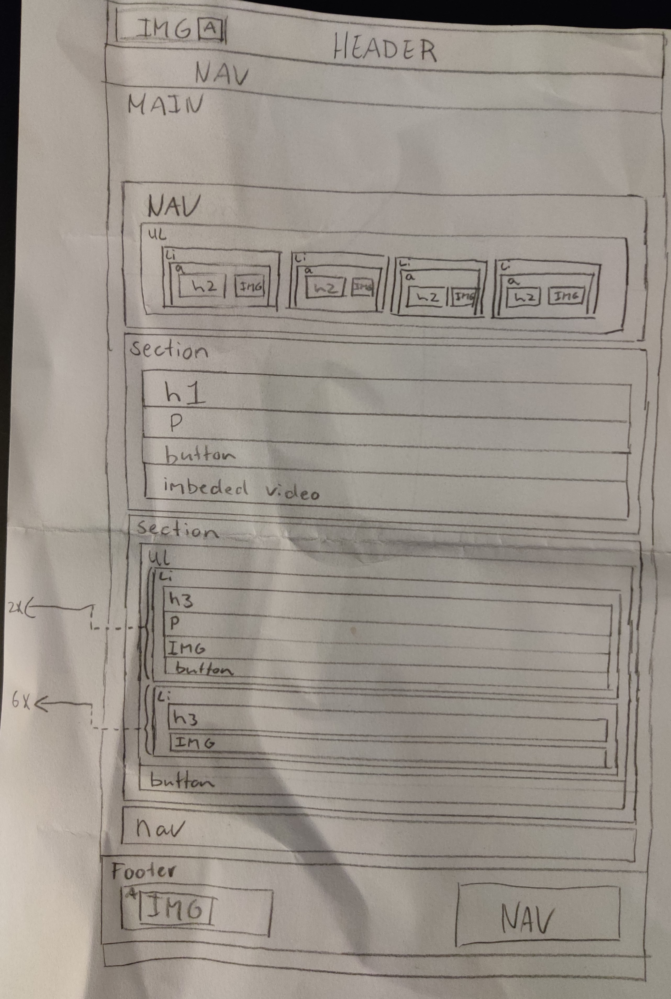

## Voortgang 1 (week 2)

uitwerken voor 1e voortgang

### Stand van zaken
hier dit ging goed & dit was lastig (neem ook screenshots op van delen van je website en code)
 
Ik ben deze week begonnen met de opdracht, ik heb een website uitgezocht die ik leuk vond en hier heb ik deze week een breakdownschets van gemaakt.
Ook ben ik begonnen met de opzet van mijn HTML en CSS, wat eigenlijk vrij goed ging als ik een beetje mijn breakdownschets volgde en gebruik maakte van Inspect Elements van de website zelf.
Aangezien ik al redelijk goed begrijp hoe HTML en CSS werkt, ben ik me meer gaan richten op het schrijven van mooie overzichtelijke code, door middel met het werken van grote stukken comments (zodat ik in de viewfinder al mijn stukken gelijk kan vinden).
Ook ben ik al begonnen met het toevoegen van CSS variable selectors (zie afb).
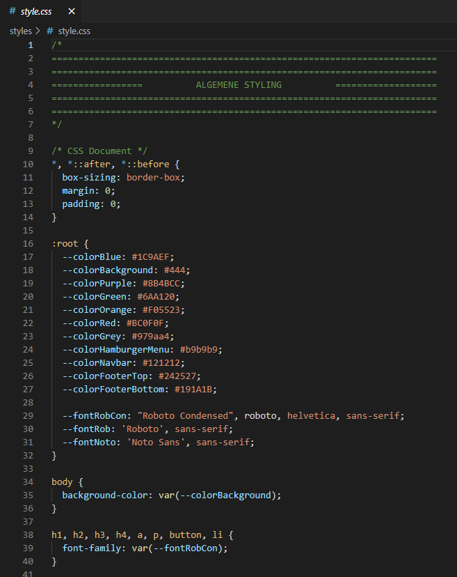

### Verslag van meeting
hier na afloop snel de uitkomsten van de meeting vastleggen

- Een aantal tips gekregen over het verder gaan met mijn code , ik liep wat vast maar al snel opgelost.
- Hulp vragen als ik vast kom te zitten in plaats van uren ernaar staren
- Eerst richten op dat alle HTML er in staat, dan pas CSS en pas als laatst de JS.

## Voortgang 2 (week 3)

uitwerken voor 2e voortgang

### Stand van zaken
hier dit ging goed & dit was lastig (neem ook screenshots op van delen van je website en code)
 
Ik ben deze week goed aan de slag geweest met FED, voornamelijk mijn eerste pagina die bijna af is (ik moet hem alleen nog responsive maken en stukje JS er in zetten).
Het ging eigenlijk vrij soepel allemaal, het was alleen even veel werk.
Ook merkte ik dat het voor mij heel veel schilde als ik met _comments_ werkte, zoals in css met bijv de /* ====== */ , waardoor ik heel overzichtelijk alles steeds terug kon vinden.
Wat ik net wel eigenlijk zag, was dat mijn website, de hele tijd werkt met background-image op een element in plaats van een afbeelding te nesten. Ik vraag mij hier alleen mee af, of dat op die wijze nog steeds toegankelijk is voor mensen met een screenreader o.i.d. , of dat ik beter door kan gaan zoals eerst met gewoon een losse afbeelding genest in een ander element.
Ook had ik wat problemen met _position: sticky_ te mixen met overflow-x: hidden, omdat wanneer ik een overflow-x hidden op de html & body zetten, mijn position sticky niets meer deed. Ik moest een overflow-x hidden op de body zetten vanwege dat ik bij het responsive maken van mijn pagina, de body / html niet de volledige viewport width in beslag nam, maar alleen maar 0.8 daarvan. Dit kon ik oplossen door overflow-x hidden, maar moest dat toen uiteindelijk op de header, main en footer doen ipv van de body.
 
Voor de rest heb ik alvast gekeken naar de breakpoints van de _echte_ eerste pagina, op hoeveel pixel er wat gebeurt, en heb dat opgeschreven met een omschrijving wat er precies veranderd, zodat ik dit makkelijker kan maken.

### Verslag van meeting
hier na afloop snel de uitkomsten van de meeting vastleggen

- Zet niet overal een Width of een Height op met CSS (geeft vaak problemen)
- Kijk met Inspect Elements naar waar het probleem zit (schakel een ding uit, een ander aan, kijk of het opgelost is)
- Ga ook aan de slag met de tweede pagina, niet alleend de eerste.

## Toegankelijkheidstest (week 4)

uitwerken na test in 8e voortgang

Ik heb een aantal tests afgenomen samen met een klasgenoot, van onder andere de screenreader, een aantal verschillende brillen, de test met aandachtsproblemen, en slechte motoriek.
Hier onder zal ik een aantal afbeeldingen plaatsten met mijn aantekeningen van deze dag.
Aantekening screenreader

 
Aantekening slechte motoriek 1 + slecht zicht
 

 
Aantekening slechte motoriek 2 + bevindingen html zelf
 

## Voortgang 3 (week 4)

uitwerken voor 3e voortgang

### Stand van zaken
hier dit ging goed & dit was lastig (neem ook screenshots op van delen van je website en code)
 
Deze week is het vrij soepel verlopen. Ik ben heel wat opgeschoten en zelfs bijna klaar met mijne eerste pagina. Mijn tweede pagina ben ik al goed opweg, maar moet nog wel wat aan gebeuren.
Ik liep deze week wel tegen een aantal problemen aan toen ik aan de slag wilde gaan met het responsive maken, zoals dat de video een rare verhouding had gekregen of dat ik de content op een bepaalde viewport width vast wilde zetten in het midden en de achtergrond door wilde laten gaan. Met wat gepuzzel ( en de hulp van Vasilis ) is mij dit uiteindelijk wel gelukt wat ik echt super fijn vond.
Het grootste punt waar ik deze week tegenaan liep was een stukje met Grid. Ik wilde mijn artikelen op een bepaalde viewport width in een grid zetten van 2 bij 2, en later zelfs eerste twee artikelen 1x2 en de rest 3x2. Ik liep alleen tegen het probleem dat mijn afbeeldingen / sections van mijn artikelen elkaar overlapte en niet kleiner werden ondanks dat ik 1fr gebruikte. Samen met Vasilis ben ik erachter gekomen dat dit kwam vanwege dat ik overal een vaste width waarde op had staan, wat mijn grid dus raar maakte. 
Uiteindelijk is het allemaal wel gelukt, en hoef ik voor pagina 1 nog maaar een aantal kleine dingentjes te doen zoals het toevoegen van de timestamps, het mega-menu laten zien bij een viewport van 1024px, en 'read more' linkjes toevoegen aan sommige artikelen.
Bij pagina 2 moet ik wel nog heel wat CSS, Responsiveness en moet ik nog het hamburger menu van de tweede pagina te laten werken met JS.
AL met al, een goede productieve week!

### Verslag van meeting
hier na afloop snel de uitkomsten van de meeting vastleggen

- Ik moet me nu focussen op pagina 2 van mijn project
- Voor de rest ben ik erg goed bezig
- Schrijf voor mezelf op welke extra dingen ik er in wil hebben (wanneer ik klaar ben met de pagina's), welke zijn mijn top priority, welke minder
- Vergeet niet de bronnenlijst toe te voegen in de code zelf
 
 
### Screenshot(s)
 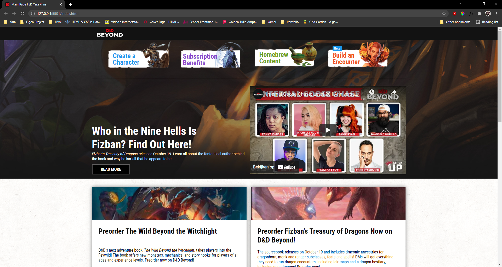
  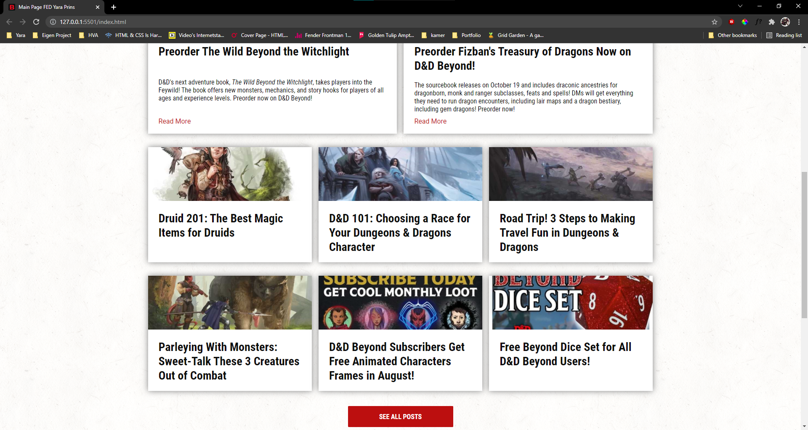
  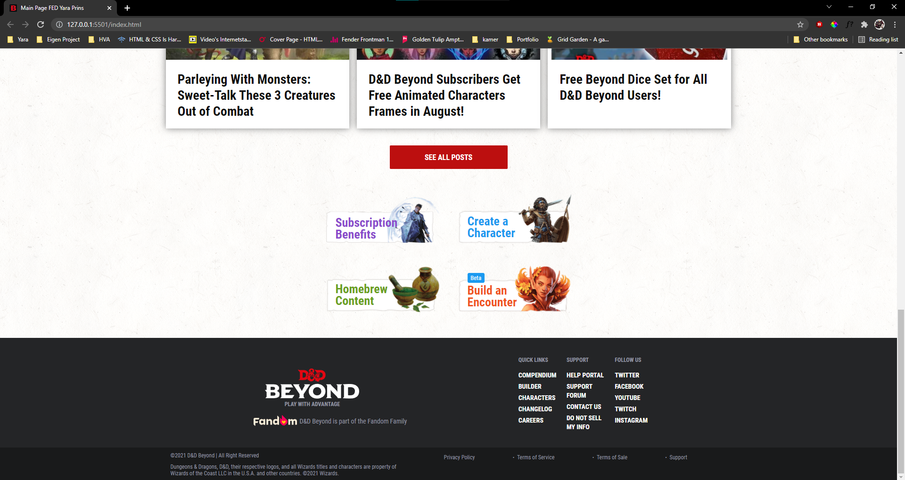
  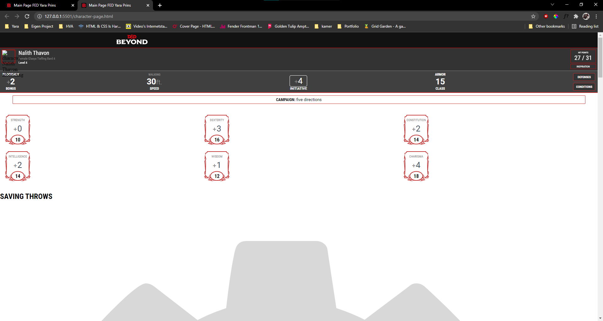
  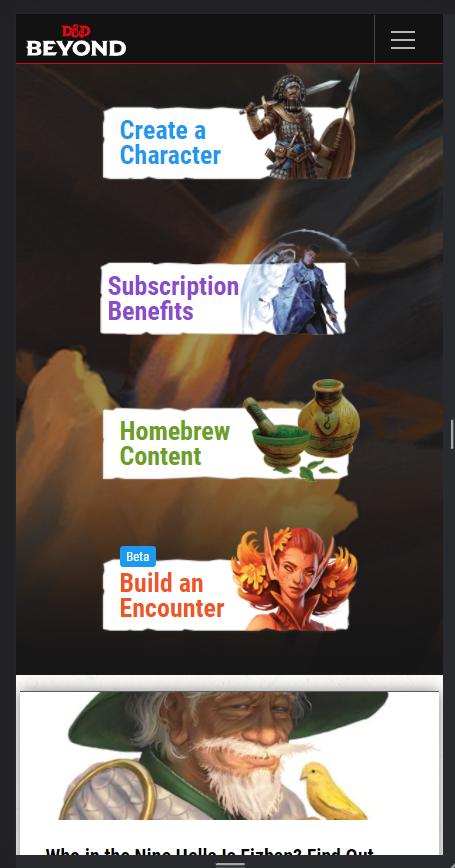
  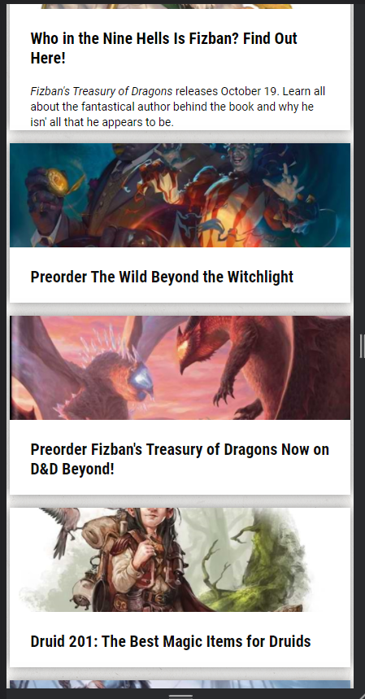
  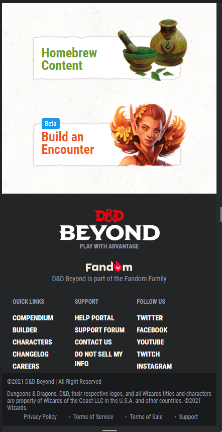
  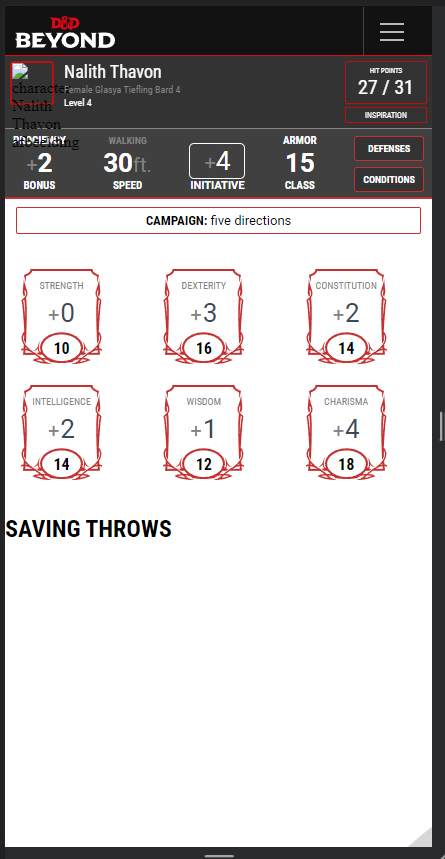

## Eindgesprek (week 5)

uitwerken voor eindgesprek

### Stand van zaken
hier dit ging goed & dit was lastig (neem ook screenshots op van delen van je website en code)
 
 Deze afgelopen week is niet goed gegaan qua werken aan mijn school opdrachten. Ik heb deze afgelopen week een goede griep te pakken gekregen, waardoor ik afgelopen week helemaal niets heb kunnen uitvoeren aan mijn werk. Ik lag namelijk anderhalve week goed ziek op bed. Ik heb dus niet verder kunnen werken aan het project, en liep hierdoor uiteindelijk flink achter.
 Dit is ook de reden waarom ik er voor gekozen heb op een herkansing te doen, aangezien ik mijn website echt niet af zou krijgen in een paar dagen.
 Tijdens mijn eindgesprek heb ik wel nog een aantal tips en tops gekregen, en al zou ik mijn proces verslag bijwerken en de AVV aantikken, zou ik op dit moment al een goed cijfer krijgen.
 Maar, voor nu moesten er nog dingen worden toegevoegd aan mijn procesverslag, moesten er nog wat interactieve dingen worden toegevoegd aan mijn code, en moet ik mijn tweede pagina af maken.
 Dit zal ik dan ook aankomende weken doen voor mijn herkansing van dit vak.

### Screenshot(s)

hier screenshot(s) van je eindresultaat

## Bronnenlijst

continu bijhouden terwijl je werkt

Nb. Wees specifiek ('css-tricks' als bron is bijv. niet specifiek genoeg).

1. https://www.dndbeyond.com/
2. https://www.dndbeyond.com/profile/Faynore/characters/17074841
3. https://stackoverflow.com/questions/14270084/overflow-xhidden-doesnt-prevent-content-from-overflowing-in-mobile-browsers/14271049#14271049
4. https://stackoverflow.com/questions/47095596/body-overflow-x-hidden-breaks-position-sticky
5. https://newbedev.com/position-sticky-not-working-with-body-overflow-x-hidden
6. https://developer.mozilla.org/en-US/docs/Web/HTML/Element/section
7. https://css-tricks.com/almanac/properties/f/flex-basis/
8. https://developer.mozilla.org/en-US/docs/Web/CSS/object-fit
9. https://www.section.io/engineering-education/embedding-a-video-into-a-webpage-using-html-and-css/
10. https://css-tricks.com/almanac/properties/a/aspect-ratio/

